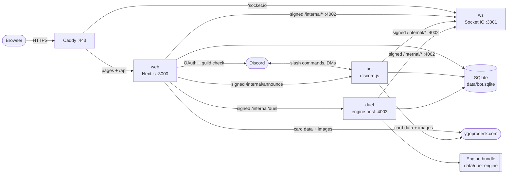
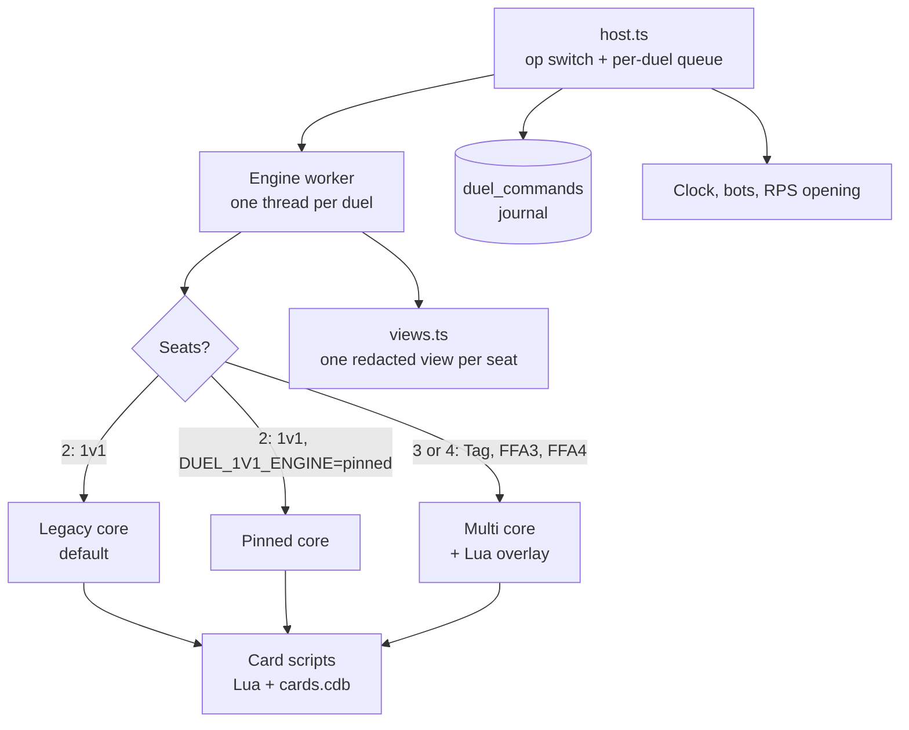
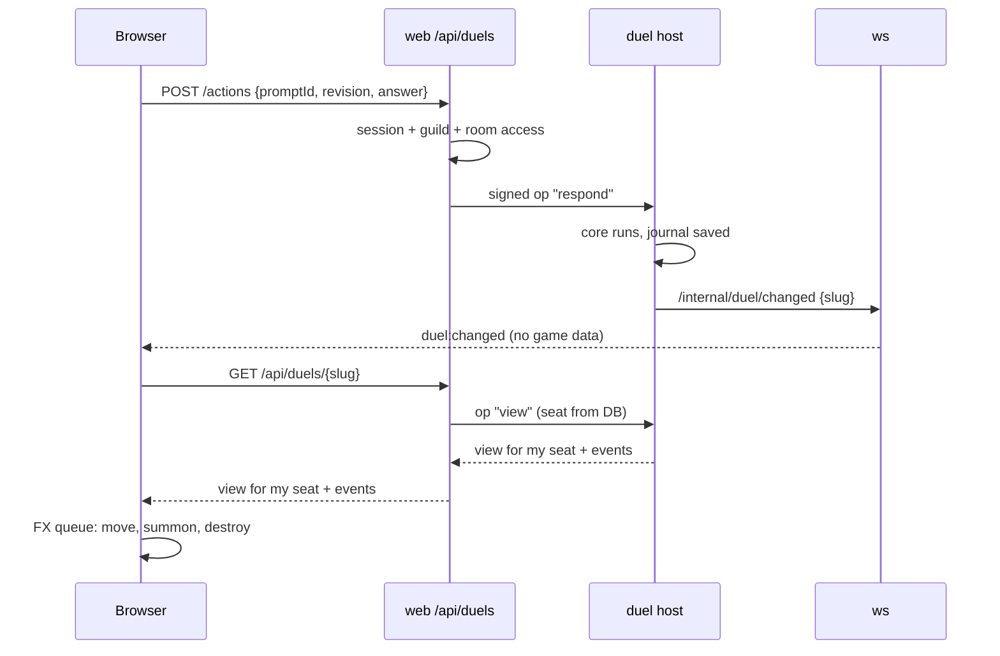
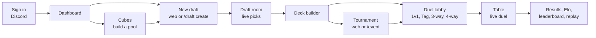

# Architecture

A short map of the system. The code is the source of truth; this page tells you where to look.

## 1. The platform

| Box | Job | Code |
|---|---|---|
| web | Pages, API routes, Discord sign-in | `packages/web` |
| ws | Live pushes only. Never carries hidden game data | `packages/ws` |
| bot | Slash commands, announcements, timers, card sync | `packages/bot` |
| duel | Runs the rules engine. Private, internal port only | `packages/duel-server` |
| shared | DB schema and all business services | `packages/shared` |

All internal calls are HMAC-signed POSTs (`shared/src/notify/signed-post.ts`). Ports 4001, 4002 and 4003 are never public.

## 2. The duel engine

**One action, start to end**

1. The host checks the `promptId` and `revision`. A stale answer gets 409.
2. The worker feeds the answer to the WASM core.
3. The host appends the command to the journal in SQLite.
4. The host builds a view for each seat. Hidden cards are removed.

**Cores.** Each core has a Standard and a Domain (Deck Master) build.

| Core | Used for | File |
|---|---|---|
| Legacy | 1v1, the default | npm `ocgcore-wasm`, `ocgcore.domain.legacy.wasm` |
| Pinned | 1v1 when `DUEL_1V1_ENGINE=pinned` | `ocgcore.standard.wasm`, `ocgcore.domain.wasm` |
| Multi | Tag, 3-way, 4-way | `ocgcore.multi.wasm`, `ocgcore.multi-domain.wasm` |

**Engine data.** `scripts/prepare-data.ts` pins the card DB (BabelCDB), strings and Lua scripts (ProjectIgnis CardScripts). `manifest.json` holds the hashes and the `bundleVersion`. The server checks the bundle at start.

**Restart safety.** Live state is in worker memory. SQLite keeps the seed and the command journal. `recover()` replays the journal on a fresh worker. A replay needs the same `bundleVersion`.

## 3. Engine to screen

- The socket only says "something changed". The browser then asks for its own view.
- The seat always comes from the DB. A client cannot act for another seat.
- If the socket is down, the page polls (1 s offline, 10 s live).
- A 5-minute signed token (`/connection`) lets a tab join the duel room.
- FX: `event-queue.ts` → `effect-sequence.ts` → `MoveFx`, `SummonFx`, `DestroyFx`.

## 4. What we added for Tag, 3-way and 4-way

| Layer | Added | Where |
|---|---|---|
| Core | ~91 patches: seat arrays, teams, elimination, team LP, opponent binding, FFA attack rules, clockwise chain order, leaving | `duel-server/domain-core/patches/` |
| Core | Domain multi core: Deck Master for 3 and 4 seats | `build-multi-core.sh`, `apply-domain-multi.mjs` |
| Core | FFA4: across seats (0+2, 1+3) share Extra Monster Zones and columns | patch 0077 |
| Scripts | Lua overlay: ~580 card fixes + `mp-utility.lua`. 1v1 never loads it | `domain-core/multi-scripts/` |
| Host | Formats, seat counts, teams, opponents | `shared/src/duels/settings.ts` |
| Host | Seat lobby, practice bots, ready, start | `shared/src/services/duels.ts` |
| Host | Attack-target pick, surrender, timeouts, autopilot for out seats | `attack-target-pick.ts`, `host.ts` |
| Host | Flag `MULTIPLAYER_TABLES` (Compose: on) | `shared/src/duels/multiplayer-tables.ts` |
| Rules | Rule list and tests | `docs/adr/0002`, `docs/specs/multiplayer-rule-coverage.md` |
| UI | 3-way and 4-way: Plaza table, aim arrow, seat crumble | `web/src/components/duel/table/` |
| UI | Tag 2v2: Rooftop, shared team LP | `web/src/components/duel/tag/` |

Not on main yet: the 4-way 2x2 grid UI, and PR #178, which changes the FFA4 shared zones from across seats (0+2, 1+3, patch 0077) to facing seats (0+1, 2+3).

## 5. How a player uses the site

## More

- Rules for multiplayer: [ADR 0002](adr/0002-multiplayer-duel-rules.md). Test layers: [ADR 0003](adr/0003-duel-test-layers.md).
- Draft dealing: [draft-engine.md](draft-engine.md). Core ABI: [engine/ocgcore-wasm-abi.md](engine/ocgcore-wasm-abi.md).
- Deploy and ops: [deployment/vm-runbook.md](deployment/vm-runbook.md), [deployment/duel-engine-switch.md](deployment/duel-engine-switch.md).
- Weekly card data updates: [deployment/engine-data-updates.md](deployment/engine-data-updates.md).

## Card artwork selection

The duel server owns selectable artwork identity: only passcodes in its `cards.cdb` artwork alias family may enter a deck picker. The authenticated web artwork route merges that family with `card_artworks` API metadata and the existing image cache, returning only local cached-image route URLs (nullable when availability is unknown). Search stays one result per card and includes `altArtCount`. Deck storage preserves selected engine passcodes; draft-pool checks canonicalize both sides without rewriting the art choice. Explicit cube rows can swap same-family artwork while retaining copy counts.

See [the picker backend contract](specs/alt-art-picker.md) for exact routes, types, alias edge cases, and the resumable `npm run backfill:artworks --workspace=packages/shared -- --database … --dump … --state …` maintenance command. The backfill downloads one full metadata dump, syncs existing catalog families, and does not fetch images. It must be run explicitly; no production backfill is part of this implementation.
